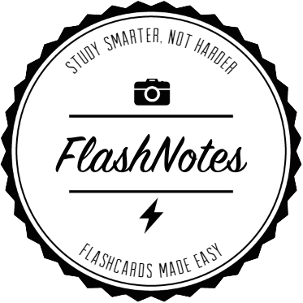
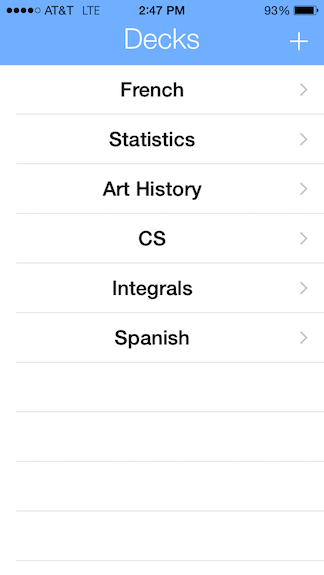
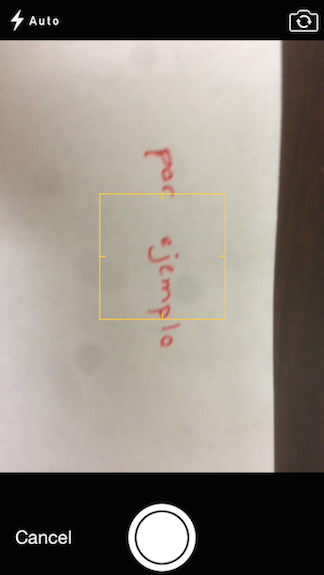
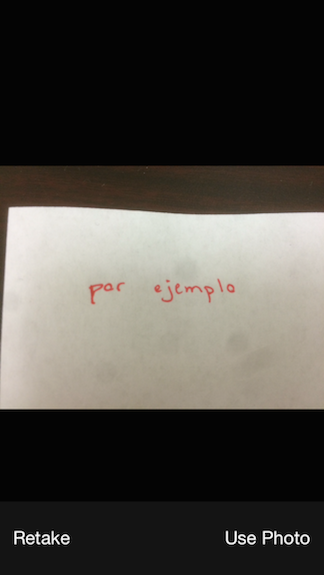
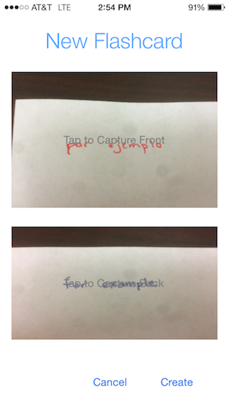

  

#FlashNotes
FlashNotes, or Simple Study or Flashkard, (name is a work in progress) is an app that turns your existing notes into flashcards. The project is a product of Luke Newman, Anish Sharma, Kevin Veloso, and Kyle Grinstead and was started at HackDuke Fall 2014 (Nov 15-16).

##Hackathon Work
At HackDuke, the project was started after a couple hours of ideating. In 24 hours, the team put together an iPhone application built in Swift that lets users create flashcard decks and add, delete, and edit flashcards in a particular deck.

Here's a quick walkthrough of how the app worked at the end of the hackathon:

####Flashcard Set Overview

  

Here, users keep track of their flashcard sets. It's a simple TableView with each set in a cell. Users can tap + to add a set or swipe left and tap Delete to delete a set.

####Flashcard Set Detail View

<!---

-->

Once a set is tapped, a UICollectionView shows the flashcards in the set. This view allows users to rearrange, edit, delete, and add flashcards to the set. Tapping on a flashcard maximizes the card and segues into the study view (yet to be implemented).

####Create Flashcard View

  

Adding a flashcard is a simple process. With the app created at HackDuke, we went about this by allowing the user to take two pictures of notes for a single flashcard (one for the front, one for the back). Tapping on the two buttons opens the camera.

  

  

Ideally, on this screen there would be options for cropping, adding text overlays, and highlighting.

  

##Concept

##Future
We have many visions for the future of the app. Here are a few:

1. Users could be able to simply snap a picture of their notes, and the app would dynamically create the flashcards on its own. This of course would require quite an interesting algorithm, and its feasibility is still under question. For example, how would the app know where to "draw the line" in terms of flashcards.

2. Users could draw lines on their notes of where they would want flashcard faces to be, snap a picture of their notes, and the app would use vision algorithms to break the photo down into flashcards. This approach would require less crazy of an algorithm, and thus is more feasible to implement.

3. Regardless of flashcard-creating process, users would be able to share their flashcard sets with classmates, encouraging teamwork and collaboration. The introduction of monetization (users selling flashcard sets) could also bring up interesting effects (higher flashcard "production value" etc.).